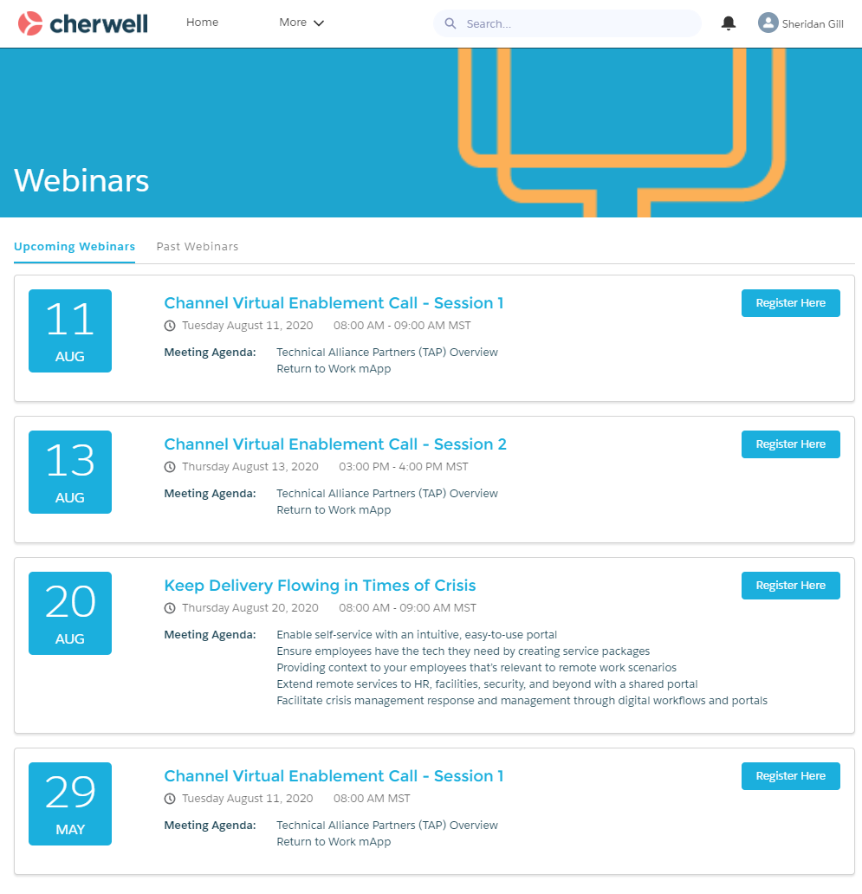

# Webinar Lightning Web Component
Salesforce Lightning Web Component displaying upcoming events and webinars.



### Component Markup
```html
<template>
  <div class="slds-card slds-col slds-m-vertical_small slds-p-bottom_small">
    <div class="slds-grid slds-wrap slds-p-around_medium">
      <div class="slds-col slds-size_2-of-12">
        <div class="event-block">
          <div class="slds-text-heading_large" style="font-size: 50px">
            {displayDay}
          </div>
          <div class="slds-text-body_small" style="font-size: 16px">
            {displayMonth}
          </div>
        </div>
      </div>
      <div class="slds-col slds-medium-size_10-of-12 slds-grid slds-wrap">
        <div class="slds-col slds-size_1-of-1 slds-grid slds-align_absolute-center">
          <div class="slds-col slds-m-right_small">
            <a href={buttonlink} target="" class="webinar-title">
              <h1>{webinarTitle}</h1>
            </a>
          </div>
          <div class="slds-no-flex">
            <a class="slds-button slds-button_brand" href={buttonlink}
              >{buttonlabel}</a>
          </div>
        </div>

        <div class="calendar-card-date slds-col slds-size_1-of-1">
          <div class="slds-media slds-media_center">
            <lightning-icon
              icon-name="utility:clock"
              alternative-text="clock"
              title="Clock"
              size="xx-small">
            </lightning-icon>
            <span class="slds-text-color_weak">&nbsp; {webinarTime} </span>
          </div>
          <div class="slds-media slds-media_center">
            <lightning-icon
              icon-name="utility:event"
              alternative-text="event"
              title="Event"
              size="xx-small">
            </lightning-icon>
            <span class="slds-text-color_weak">&nbsp; {webinarDate} </span>
          </div>
        </div>
        <div class="slds-p-top_small slds-col slds-size_1-of-6">
          <span style="font-weight: bold">Meeting Agenda:</span>
        </div>
        <div class="slds-p-top_small slds-col slds-size_5-of-6">
          <span>{agendaItem1}</span><br />
          <span>{agendaItem2}</span><br />
          <span>{agendaItem3}</span><br />
          <span>{agendaItem4}</span>
        </div>
      </div>
    </div>
  </div>
</template>
```
### Component Style
```css
.slds-card {
    box-shadow: 0 2px 2px 0 rgba(0, 0, 0, .1);
}

.event-block {
    border-radius: 5px;
    width: 6rem;
    height: 6rem;
    padding: .25rem;
    background: #1BAFDD;
    color: #FFF;
    display: inline-block;
    text-align: center;
}

.webinar-title {
    color: #1BAFDD;
    font-size: 18px;
}
```
### JavaScript File
```js
import { LightningElement, api} from 'lwc';

export default class webinar extends LightningElement {
    @api webinarTitle;
    @api webinarDate;
    @api webinarTime;
    @api displayMonth;
    @api displayDay;
    @api buttonlabel;
    @api buttonlink;
    @api agendaItem1;
    @api agendaItem2;
    @api agendaItem3;
    @api agendaItem4;  
}
```
### Meta-data File:
```xml
<?xml version="1.0" encoding="UTF-8"?>
<LightningComponentBundle xmlns="http://soap.sforce.com/2006/04/metadata" fqn="webinar">
    <apiVersion>47.0</apiVersion>
    <isExposed>true</isExposed>
    <targets>
        <target>lightning__RecordPage</target>
        <target>lightning__HomePage</target>
        <target>lightningCommunity__Page</target>
        <target>lightningCommunity__Default</target>
        <target>lightning__AppPage</target>
    </targets>
    <targetConfigs>
        <targetConfig targets="lightningCommunity__Default">
            <property name="webinarTitle" type="String" default="" label="Webinar Title" />
            <property name="webinarDate" type="String" default="" label="Date" />
            <property name="webinarTime" type="String" default="" label="Time" />
            <property name="displayMonth" type="String" default="" label="Calendar Month" />
            <property name="displayDay" type="String" default="" label="Calendar Day" />
            <property name="buttonlabel" type="String" default="" label="Button Label" />
            <property name="buttonlink" type="String" default="" label="Button Link" />
            <property name="agendaItem1" type="String" default="" label="Agenda Item 1" />
            <property name="agendaItem2" type="String" default="" label="Agenda Item 2" />
            <property name="agendaItem3" type="String" default="" label="Agenda Item 3" />
            <property name="agendaItem4" type="String" default="" label="Agenda Item 4" />
        </targetConfig>
    </targetConfigs>
</LightningComponentBundle>
```


